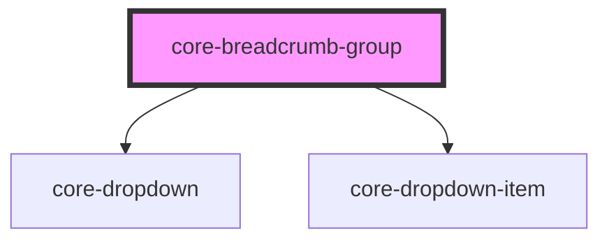

# core-badge

<!-- Auto Generated Below -->

## Properties

| Property   | Attribute  | Description                               | Type                                 | Default   |
| ---------- | ---------- | ----------------------------------------- | ------------------------------------ | --------- |
| `divider`  | `divider`  | The element divider.                      | `"chevron" \| "slash" \| "triangle"` | `"slash"` |
| `overflow` | `overflow` | Activates core-dropdown element overflow. | `boolean`                            | `false`   |

## Dependencies

### Depends on

- [core-dropdown](../core-dropdown)
- [core-dropdown-item](../core-dropdown-item)

### Graph

----------------------------------------------

*Built with [StencilJS](https://stenciljs.com/)*
