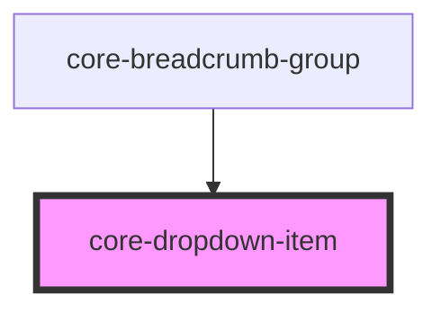

# core-dropdown-item

<!-- Auto Generated Below -->

## Properties

| Property      | Attribute      | Description                                                                                                                              | Type     | Default     |
| ------------- | -------------- | ---------------------------------------------------------------------------------------------------------------------------------------- | -------- | ----------- |
| `elementType` | `element-type` | The type of element.                                                                                                                     | `string` | `"div"`     |
| `href`        | `href`         | Contains a URL or a URL fragment that the hyperlink points to. If this property is set, an anchor tag will be rendered instead of a div. | `string` | `undefined` |
| `target`      | `target`       | Specifies where to display the linked URL. Only applies when an `href` is provided.                                                      | `string` | `undefined` |

## Dependencies

### Used by

 - [core-breadcrumb-group](../core-breadcrumb-group)

### Graph

----------------------------------------------

*Built with [StencilJS](https://stenciljs.com/)*
