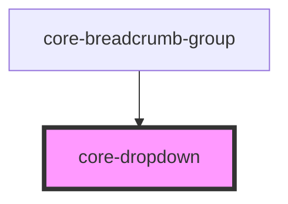

# core-dropdown

<!-- Auto Generated Below -->

## Properties

| Property    | Attribute   | Description                                                  | Type                            | Default  |
| ----------- | ----------- | ------------------------------------------------------------ | ------------------------------- | -------- |
| `active`    | `active`    | The dropdown visibility                                      | `boolean`                       | `false`  |
| `alignment` | `alignment` | The element alignment                                        | `"center" \| "left" \| "right"` | `"left"` |
| `hoverable` | `hoverable` | The dropdown will show up when hovering the dropdown-trigger | `boolean`                       | `false`  |
| `wrap`      | `wrap`      | The dropdown will wrap if applied.                           | `boolean`                       | `false`  |

## Dependencies

### Used by

 - [core-breadcrumb-group](../core-breadcrumb-group)

### Graph

----------------------------------------------

*Built with [StencilJS](https://stenciljs.com/)*
