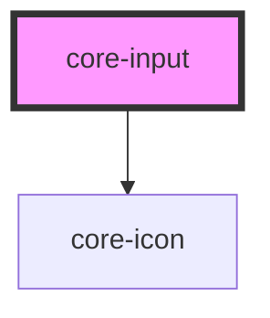

# core-input

<!-- Auto Generated Below -->

## Properties

| Property             | Attribute              | Description                                                                                                                                                                                                                                                                                                                  | Type                                                                                                                                                                                                                                                                                                                                                                                                                                                                                                                                                                                                                                                                                                                                                           | Default     |
| -------------------- | ---------------------- | ---------------------------------------------------------------------------------------------------------------------------------------------------------------------------------------------------------------------------------------------------------------------------------------------------------------------------- | -------------------------------------------------------------------------------------------------------------------------------------------------------------------------------------------------------------------------------------------------------------------------------------------------------------------------------------------------------------------------------------------------------------------------------------------------------------------------------------------------------------------------------------------------------------------------------------------------------------------------------------------------------------------------------------------------------------------------------------------------------------- | ----------- |
| `autofocus`          | `autofocus`            | Boolean attribute lets you specify that a form control should have input focus when the page loads.                                                                                                                                                                                                                          | `boolean`                                                                                                                                                                                                                                                                                                                                                                                                                                                                                                                                                                                                                                                                                                                                                      | `false`     |
| `clearInput`         | `clear-input`          | If `true`, a clear icon will appear in the input when there is a value. Clicking it clears the input.                                                                                                                                                                                                                        | `boolean`                                                                                                                                                                                                                                                                                                                                                                                                                                                                                                                                                                                                                                                                                                                                                      | `false`     |
| `color`              | `color`                | Optional color of the label (inherited). Use any `@color` in [core-primitives](https://unpkg.com/@core-ds/primitives/core-primitives.less) without `@color-`.                                                                                                                                                                | `"green" \| "yellow" \| "red" \| "black" \| "blue" \| "white" \| "blue-light-4" \| "blue-light-3" \| "blue-light-2" \| "blue-light-1" \| "blue-dark-1" \| "blue-dark-2" \| "blue-dark-3" \| "blue-dark-4" \| "green-light-4" \| "green-light-3" \| "green-light-2" \| "green-light-1" \| "green-dark-1" \| "green-dark-2" \| "green-dark-3" \| "green-dark-4" \| "yellow-light-4" \| "yellow-light-3" \| "yellow-light-2" \| "yellow-light-1" \| "yellow-dark-1" \| "yellow-dark-2" \| "yellow-dark-3" \| "yellow-dark-4" \| "red-light-4" \| "red-light-3" \| "red-light-2" \| "red-light-1" \| "red-dark-1" \| "red-dark-2" \| "red-dark-3" \| "red-dark-4" \| "gray-1" \| "gray-2" \| "gray-3" \| "gray-4" \| "gray-5" \| "gray-6" \| "gray-7" \| "gray-8"` | `"gray-8"`  |
| `disabled`           | `disabled`             | If `true`, the user cannot interact with the element.                                                                                                                                                                                                                                                                        | `boolean`                                                                                                                                                                                                                                                                                                                                                                                                                                                                                                                                                                                                                                                                                                                                                      | `false`     |
| `error`              | `error`                | If `true`, the pre-defined error state is applied.                                                                                                                                                                                                                                                                           | `boolean`                                                                                                                                                                                                                                                                                                                                                                                                                                                                                                                                                                                                                                                                                                                                                      | `false`     |
| `icon`               | `icon`                 | The core-icon to render inside the text input.                                                                                                                                                                                                                                                                               | `string`                                                                                                                                                                                                                                                                                                                                                                                                                                                                                                                                                                                                                                                                                                                                                       | `undefined` |
| `inputKeyboard`      | `input-keyboard`       | A hint to the browser for which keyboard to display.                                                                                                                                                                                                                                                                         | `"decimal" \| "email" \| "none" \| "numeric" \| "search" \| "tel" \| "text" \| "url"`                                                                                                                                                                                                                                                                                                                                                                                                                                                                                                                                                                                                                                                                          | `undefined` |
| `label`              | `label`                | The label element associated with the element.                                                                                                                                                                                                                                                                               | `string`                                                                                                                                                                                                                                                                                                                                                                                                                                                                                                                                                                                                                                                                                                                                                       | `undefined` |
| `labelDisplay`       | `label-display`        | Sets the optional label to `inline` or `block` style [CSS display property](https://developer.mozilla.org/en-US/docs/Web/CSS/display).                                                                                                                                                                                       | `"block" \| "inline"`                                                                                                                                                                                                                                                                                                                                                                                                                                                                                                                                                                                                                                                                                                                                          | `"block"`   |
| `labelPositionProps` | `label-position-props` | The label element position.                                                                                                                                                                                                                                                                                                  | `"left" \| "right"`                                                                                                                                                                                                                                                                                                                                                                                                                                                                                                                                                                                                                                                                                                                                            | `"left"`    |
| `placeholder`        | `placeholder`          | Instructional placeholder text that shows before the element has a value.                                                                                                                                                                                                                                                    | `string`                                                                                                                                                                                                                                                                                                                                                                                                                                                                                                                                                                                                                                                                                                                                                       | `undefined` |
| `required`           | `required`             | If `true`, the user must fill in a value before submitting a form.                                                                                                                                                                                                                                                           | `boolean`                                                                                                                                                                                                                                                                                                                                                                                                                                                                                                                                                                                                                                                                                                                                                      | `false`     |
| `size`               | `size`                 | Apply the large pre-defined element size and styling.                                                                                                                                                                                                                                                                        | `"large"`                                                                                                                                                                                                                                                                                                                                                                                                                                                                                                                                                                                                                                                                                                                                                      | `undefined` |
| `success`            | `success`              | If `true`, the pre-defined success state is applied.                                                                                                                                                                                                                                                                         | `boolean`                                                                                                                                                                                                                                                                                                                                                                                                                                                                                                                                                                                                                                                                                                                                                      | `false`     |
| `type`               | `type`                 | How an <input> works varies considerably depending on the value of its type attribute, hence the different types are covered in their own separate reference pages. If this attribute is not specified, the default type adopted is `text`. [<input> types](https://developer.mozilla.org/en-US/docs/Web/HTML/Element/input) | `string`                                                                                                                                                                                                                                                                                                                                                                                                                                                                                                                                                                                                                                                                                                                                                       | `"text"`    |

## Dependencies

### Depends on

- [core-icon](../core-icon)

### Graph

----------------------------------------------

*Built with [StencilJS](https://stenciljs.com/)*
