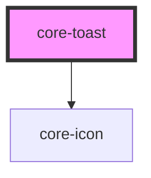

# core-toast

<!-- Auto Generated Below -->

## Properties

| Property | Attribute | Description                                       | Type                                      | Default   |
| -------- | --------- | ------------------------------------------------- | ----------------------------------------- | --------- |
| `color`  | `color`   | Optional color of the toast. Defaults to `black`. | `"green" \| "red" \| "white" \| "yellow"` | `"white"` |

## Dependencies

### Depends on

- [core-icon](../core-icon)

### Graph

----------------------------------------------

*Built with [StencilJS](https://stenciljs.com/)*
