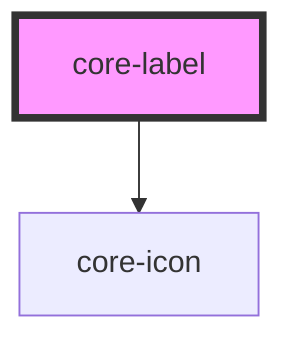

# core-label

<!-- Auto Generated Below -->

## Properties

| Property   | Attribute  | Description                                                                                                                                                                                    | Type                  | Default     |
| ---------- | ---------- | ---------------------------------------------------------------------------------------------------------------------------------------------------------------------------------------------- | --------------------- | ----------- |
| `color`    | `color`    | Optional color of the label. Use any `@color` in [core-primitives](https://unpkg.com/@core-ds/primitives/core-primitives.less) without `@color-`. (e.g. `color="red"`, `color="gray-2"`, etc). | `string`              | `undefined` |
| `disabled` | `disabled` | If `true`, the user cannot interact with the nested element (typically core-input).                                                                                                            | `boolean`             | `false`     |
| `display`  | `display`  | The display determines where and how the label behaves inside an item.                                                                                                                         | `"block" \| "inline"` | `"block"`   |
| `helpurl`  | `helpurl`  | Applies the provided URL to the helpIcon href.                                                                                                                                                 | `string`              | `undefined` |

## Dependencies

### Depends on

- [core-icon](../core-icon)

### Graph

----------------------------------------------

*Built with [StencilJS](https://stenciljs.com/)*
