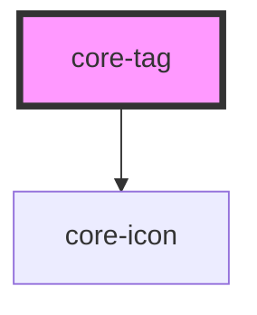

# core-tag

<!-- Auto Generated Below -->

## Properties

| Property    | Attribute   | Description                                                                                                                                                                            | Type                                                | Default     |
| ----------- | ----------- | -------------------------------------------------------------------------------------------------------------------------------------------------------------------------------------- | --------------------------------------------------- | ----------- |
| `closable`  | `closable`  | Allows the tag to be closable and removed from the view.                                                                                                                               | `boolean`                                           | `false`     |
| `color`     | `color`     | Optional primary color of the tag. Defaults to `black`. Use the following `@color` in [core-primitives](https://unpkg.com/@core-ds/primitives/core-primitives.less) without `@color-`. | `"black" \| "blue" \| "green" \| "red" \| "yellow"` | `"black"`   |
| `size`      | `size`      | The pre-defined tag size.                                                                                                                                                              | `"large" \| "small"`                                | `"large"`   |
| `variation` | `variation` | The tag variation.                                                                                                                                                                     | `"default" \| "light"`                              | `"default"` |

## Dependencies

### Depends on

- [core-icon](../core-icon)

### Graph

----------------------------------------------

*Built with [StencilJS](https://stenciljs.com/)*
