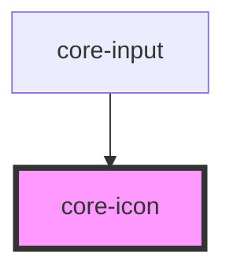

# core-icon

<!-- Auto Generated Below -->

## Properties

| Property    | Attribute    | Description                                                                                                                                                                                        | Type           | Default     |
| ----------- | ------------ | -------------------------------------------------------------------------------------------------------------------------------------------------------------------------------------------------- | -------------- | ----------- |
| `ariaLabel` | `aria-label` | Specifies the label to use for accessibility. Defaults to the icon name.                                                                                                                           | `string`       | `undefined` |
| `color`     | `color`      | Optional fill color of the icon. Use any `@color` in [core-primatives](https://unpkg.com/@core-ds/primitives/core-primitives.less) without `@color-`. (e.g. `color="red"`, `color="gray-2"`, etc). | `string`       | `undefined` |
| `icon`      | `icon`       | A combination of both `name` and `src`. If a `src` url is detected it will set the `src` property. Otherwise it assumes it's a built-in named SVG and set the `name` property.                     | `any`          | `undefined` |
| `lazy`      | `lazy`       | If enabled, core-icon will be loaded lazily when it's visible in the viewport. Default, `false`.                                                                                                   | `boolean`      | `false`     |
| `name`      | `name`       | Specifies which icon to use from `src/core-icons`.                                                                                                                                                 | `string`       | `undefined` |
| `size`      | `size`       | The size of the icon. Available options are: `"16"` and `"24"`. Default, `16`.                                                                                                                     | `"16" \| "24"` | `"16"`      |
| `src`       | `src`        | Specifies the exact `src` of an SVG file to use.                                                                                                                                                   | `string`       | `undefined` |

## Dependencies

### Used by

 - [core-input](../core-input)

### Graph

----------------------------------------------

*Built with [StencilJS](https://stenciljs.com/)*
