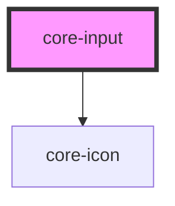

# core-input

<!-- Auto Generated Below -->

## Properties

| Property        | Attribute       | Description                                                                                                                                                                                                                                                                                                                  | Type                                                                                  | Default        |
| --------------- | --------------- | ---------------------------------------------------------------------------------------------------------------------------------------------------------------------------------------------------------------------------------------------------------------------------------------------------------------------------- | ------------------------------------------------------------------------------------- | -------------- |
| `autofocus`     | `autofocus`     | Boolean attribute lets you specify that a form control should have input focus when the page loads.                                                                                                                                                                                                                          | `boolean`                                                                             | `false`        |
| `clearInput`    | `clear-input`   | If `true`, a clear icon will appear in the input when there is a value. Clicking it clears the input.                                                                                                                                                                                                                        | `boolean`                                                                             | `false`        |
| `disabled`      | `disabled`      | If `true`, the user cannot interact with the input.                                                                                                                                                                                                                                                                          | `boolean`                                                                             | `false`        |
| `icon`          | `icon`          | The core-icon to render inside the text input.                                                                                                                                                                                                                                                                               | `string`                                                                              | `undefined`    |
| `inputkeyboard` | `inputkeyboard` | A hint to the browser for which keyboard to display. Possible values: `"none"`, `"text"`, `"tel"`, `"url"`, `"email"`, `"numeric"`, `"decimal"`, and `"search"`.                                                                                                                                                             | `"decimal" \| "email" \| "none" \| "numeric" \| "search" \| "tel" \| "text" \| "url"` | `undefined`    |
| `name`          | `name`          | The name of the control, which is submitted with the form data.                                                                                                                                                                                                                                                              | `string`                                                                              | `this.inputId` |
| `placeholder`   | `placeholder`   | Instructional placeholder text that shows before the input has a value.                                                                                                                                                                                                                                                      | `string`                                                                              | `undefined`    |
| `required`      | `required`      | If `true`, the user must fill in a value before submitting a form.                                                                                                                                                                                                                                                           | `boolean`                                                                             | `false`        |
| `size`          | `size`          | The large pre-defined input size and styling. Use: `"large"`.                                                                                                                                                                                                                                                                | `"large"`                                                                             | `undefined`    |
| `type`          | `type`          | How an <input> works varies considerably depending on the value of its type attribute, hence the different types are covered in their own separate reference pages. If this attribute is not specified, the default type adopted is `text`. [<input> types](https://developer.mozilla.org/en-US/docs/Web/HTML/Element/input) | `string`                                                                              | `"text"`       |

## Methods

### `getInputElement() => Promise<HTMLInputElement>`

Returns the native `<input>` element.

#### Returns

Type: `Promise<HTMLInputElement>`

## Dependencies

### Depends on

- [core-icon](../core-icon)

### Graph

----------------------------------------------

*Built with [StencilJS](https://stenciljs.com/)*
