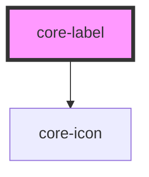

# core-label

<!-- Auto Generated Below -->

## Properties

| Property   | Attribute   | Description                                                                           | Type                  | Default     |
| ---------- | ----------- | ------------------------------------------------------------------------------------- | --------------------- | ----------- |
| `display`  | `display`   | The display determines where and how the label behaves inside an item.                | `"block" \| "inline"` | `"block"`   |
| `forId`    | `for-id`    | The id of a labelable form-related element.                                           | `string`              | `undefined` |
| `helpIcon` | `help-icon` | Displays the question mark help anchor icon on the right side of the label container. | `boolean`             | `false`     |
| `helpUrl`  | `help-url`  | Applies the provided URL to the helpIcon href.                                        | `string`              | `undefined` |

## Dependencies

### Depends on

- [core-icon](../core-icon)

### Graph

----------------------------------------------

*Built with [StencilJS](https://stenciljs.com/)*
