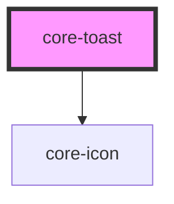

# core-toast

<!-- Auto Generated Below -->

## Properties

| Property | Attribute | Description                                                                                                                                                    | Type                                      | Default   |
| -------- | --------- | -------------------------------------------------------------------------------------------------------------------------------------------------------------- | ----------------------------------------- | --------- |
| `color`  | `color`   | Optional primary color of the toast. Defaults to `black`. Use: `color="white"`, `color="green"`, `color="yellow"`, `color="red"`. Defaults to `color="white"`. | `"green" \| "red" \| "white" \| "yellow"` | `"white"` |

## Dependencies

### Depends on

- [core-icon](../core-icon)

### Graph

----------------------------------------------

*Built with [StencilJS](https://stenciljs.com/)*
